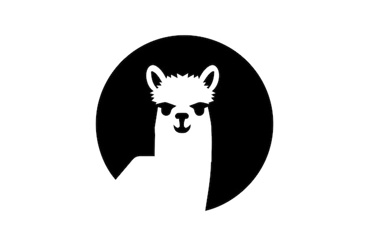

<p align="center">
  
</p>

<h1 align="center">neev</h1>

<p align="center">
  <em>Zero-dependency Python CLI for sharing local directories over HTTP — with auth, file browsing, ZIP downloads, and uploads.</em>
</p>

<p align="center">
  <a href="https://pypi.org/project/neev/"></a>
  <a href="https://pypi.org/project/neev/"></a>
  <a href="https://pypi.org/project/neev/"></a>
  <a href="https://github.com/prabhuakshay/neev/blob/main/LICENSE"></a>
  <a href="https://github.com/prabhuakshay/neev/actions/workflows/ci.yml"></a>
  <a href="https://github.com/prabhuakshay/neev/actions/workflows/publish.yml"></a>
  
  
  <a href="https://github.com/astral-sh/ruff"></a>
  <a href="https://github.com/astral-sh/uv"></a>
</p>

---

## Table of Contents

- [Why neev?](#why-neev)
- [Install](#install)
- [Quick Start](#quick-start)
- [CLI Reference](#cli-reference)
- [Configuration File (`neev.toml`)](#configuration-file-neevtoml)
- [Environment Variables](#environment-variables)
- [Configuration Precedence](#configuration-precedence)
- [Features](#features)
- [HTTP API](#http-api)
- [Security Model](#security-model)
- [Recipes](#recipes)
- [Architecture](#architecture)
- [Development](#development)
- [Troubleshooting](#troubleshooting)
- [FAQ](#faq)
- [Contributing](#contributing)
- [License](#license)

---

## Why neev?

`python -m http.server` is great, but it has no authentication, no way to download a folder, no uploads, and exposes dotfiles by default. neev is the drop-in replacement with the things you actually need:

- **HTTP Basic Auth** — constant-time credential comparison
- **ZIP folder downloads** — streamed on the fly, no temp files
- **File uploads** — opt-in, with size limits and path-traversal protection
- **Clean browser UI** — dark/light theme, Markdown preview, syntax-aware file icons
- **HTTP Range support** — resumable downloads, video/audio seeking
- **Concurrent requests** — threaded server, not single-request-at-a-time
- **Secure defaults** — localhost-only, no writes, no hidden files
- **Zero dependencies** — pure Python stdlib, Python 3.11+

Built for developers sharing build artifacts, teams exchanging files on a LAN, and anyone who wants `http.server` but grown up.

---

## Install

### From PyPI (recommended)

```bash
# with uv (fastest)
uv tool install neev

# or pipx
pipx install neev

# or plain pip
pip install neev
```

### Run without installing

```bash
uvx neev --dir ./public
```

### From source

```bash
git clone https://github.com/prabhuakshay/neev
cd neev
uv sync
uv run neev --help
```

**Requires Python 3.11 or newer.** Works on Linux, macOS, and Windows.

---

## Quick Start

```bash
# Serve the current directory on http://127.0.0.1:8000
neev

# Serve a specific directory
neev ./public

# With auth, on all interfaces, custom port
neev ./share --host 0.0.0.0 --port 8080 --auth alice:s3cret

# Full-featured: auth + uploads + zip downloads
neev ./share --auth alice:s3cret --enable-upload --enable-zip-download
```

Open the URL printed on startup. You'll see a file browser. If auth is enabled, your browser will prompt for credentials.

---

## CLI Reference

```
neev [DIRECTORY] [OPTIONS]
neev share <PATH> [--expires SECONDS] [--write] [-d DIRECTORY]
```

### Positional arguments

| Argument | Default | Description |
|----------|---------|-------------|
| `directory` | `.` | Directory to serve. Must exist. Resolved to its real path (symlinks followed). |

### Options

| Flag | Default | Description |
|------|---------|-------------|
| `--host HOST` | `127.0.0.1` | Address to bind. Use `0.0.0.0` to expose on LAN. |
| `--port PORT`, `-p PORT` | `8000` | TCP port (1–65535). |
| `--auth USER:PASS` | _(none)_ | Enable HTTP Basic Auth. |
| `--show-hidden` / `--no-show-hidden` | off | Show dotfiles and `neev.toml` in listings. |
| `--enable-zip-download` / `--no-enable-zip-download` | off | Allow folders to be downloaded as streamed ZIP. |
| `--max-zip-size MB` | `100` | Maximum ZIP archive size in MB. Rejected if exceeded. |
| `--enable-upload` / `--no-enable-upload` | off | Allow multipart file uploads from the browser. |
| `--read-only` / `--no-read-only` | off | Force-disable uploads (overrides `--enable-upload`). |
| `--banner TEXT` | _(none)_ | Message displayed at the top of directory listings. |
| `--public-url URL` | _(none)_ | External base URL when running behind a reverse proxy. |
| `-h`, `--help` | — | Show help and exit. |

All boolean flags use `argparse.BooleanOptionalAction`, so `--no-<flag>` works too — useful for overriding `neev.toml` from the CLI.

### Examples

```bash
# Read-only share even if TOML enables uploads
neev ./build --read-only

# Serve on LAN with auth, show dotfiles, custom banner
neev ./code --host 0.0.0.0 --auth me:pw --show-hidden --banner "Internal only"

# Raise ZIP size cap to 500 MB
neev ./data --enable-zip-download --max-zip-size 500
```

### `neev share` subcommand

Mint a signed, time-limited URL that grants scoped access to one file or folder. See the [share recipe](#share-a-file-with-an-expiring-link) for the full flow.

| Argument / flag | Default | Description |
|-----------------|---------|-------------|
| `path` | — | File or folder under the served directory. |
| `-d`, `--directory` | `.` | Served directory — the scope that gives `path` meaning. |
| `--expires SECONDS` | `86400` | Token validity window in seconds. |
| `--write` | off | Token authorizes POST/upload. Server must still have `--enable-upload`. |

The secret is read from `neev.toml`'s `share-secret` key; if unset, one is generated per invocation and printed to stderr.

---

## Configuration File (`neev.toml`)

neev reads `neev.toml` from **two locations**:

1. **Local** — `neev.toml` in the served directory. Project-specific settings.
2. **User** — per-user defaults at:
   - `$XDG_CONFIG_HOME/neev/neev.toml` if `XDG_CONFIG_HOME` is set, or
   - `%APPDATA%\neev\neev.toml` on Windows, or
   - `~/.config/neev/neev.toml` elsewhere (Linux, macOS, BSD).

Both files use the same schema. A missing file is silently skipped; a malformed file logs a warning and is ignored.

### Example

```toml
# ./neev.toml
host = "0.0.0.0"
port = 9000
show-hidden = false
enable-zip-download = true
max-zip-size = 250
enable-upload = false
read-only = false
banner = "Build artifacts — ask #devops for access"
```

### Recognized keys

| TOML key | Type | Notes |
|----------|------|-------|
| `host` | string | Same as `--host`. |
| `port` | integer | Same as `--port`. |
| `auth` | string | `"user:pass"`. Same as `--auth`. |
| `show-hidden` | bool | Same as `--show-hidden`. |
| `enable-zip-download` | bool | Same as `--enable-zip-download`. |
| `max-zip-size` | integer | MB. Same as `--max-zip-size`. |
| `enable-upload` | bool | Same as `--enable-upload`. |
| `read-only` | bool | Same as `--read-only`. |
| `banner` | string | Same as `--banner`. |
| `public-url` | string | Same as `--public-url`. |
| `share-secret` | string | Hex-encoded HMAC key (≥ 32 bytes after decode) for `neev share` tokens. Auto-generated if unset. |

**Denied keys:** `directory` is never read from TOML (the served directory is always set by CLI, to avoid surprise path changes).

**Unknown keys** are logged at WARN level and ignored. **Malformed TOML** is logged and the file is skipped — neev keeps running with CLI defaults.

The `neev.toml` file itself is hidden from listings unless `--show-hidden` is set.

### Credentials in user config

`~/.config/neev/neev.toml` is the intended home for per-user credentials (`auth = "user:pass"`). It's in your home directory — chmod it to `600` so other users on the machine can't read it:

```bash
chmod 600 ~/.config/neev/neev.toml
```

neev does not read any `NEEV_*` environment variables. Flags, local `neev.toml`, and user `neev.toml` are the only config sources.

---

## Configuration Precedence

From highest to lowest — later sources only fill in values the earlier ones left unset:

1. **CLI flags** (explicit `--foo bar`)
2. **Local `neev.toml`** in the served directory
3. **User `neev.toml`** at `~/.config/neev/neev.toml` (or XDG / `%APPDATA%` equivalent)
4. **Built-in defaults** (see CLI reference table)

The startup banner prints every `neev.toml` that contributed values, so you can always see where a setting came from.

---

## Features

### File browser

- Directory listing with sortable columns (name, size, modified).
- Per-file icons by extension/type.
- Breadcrumb navigation.
- In-browser preview for text files, Markdown (rendered), images, and PDFs.
- Correct MIME types and charset detection per file.

### ZIP folder downloads

- Triggered by a "Download as ZIP" button on any folder (if `--enable-zip-download`).
- **Streamed** — no temp files, constant memory usage.
- Capped at `--max-zip-size` MB; oversized archives return `413 Payload Too Large`.
- Hidden files excluded unless `--show-hidden`.

### Uploads

- Opt-in via `--enable-upload`. Disabled under `--read-only`.
- Multipart upload form on each directory page.
- Filename sanitization — path traversal, null bytes, and absolute paths rejected.
- Writes land in the directory currently being viewed.
- Authentication (if configured) is required.

### HTTP Range requests

Partial content (`206`) supported for all file downloads — resumable downloads, video/audio seeking, `curl -C -`.

### Concurrency

Threaded `HTTPServer` — multiple clients can browse, download, and upload simultaneously.

### Authentication

- HTTP Basic Auth.
- Credentials compared with `hmac.compare_digest` (constant-time).
- Failed auth returns `401` with a `WWW-Authenticate: Basic` challenge.

---

## HTTP API

neev is primarily browser-driven, but every interaction is a plain HTTP request — scriptable with `curl`, `wget`, `httpie`, etc.

### Listing / serving files

```http
GET /path/to/dir/      → HTML directory listing
GET /path/to/file.txt  → file contents (with Range support)
```

Trailing slash → directory; no slash → file. Requests to a path without a trailing slash that resolves to a directory are redirected with `301` to the canonical slashed URL.

### ZIP download

```http
GET /path/to/dir/?zip=1
```

Returns `application/zip` stream. Filename is `<dirname>.zip`. Disabled unless `--enable-zip-download`.

### File preview (rendered)

```http
GET /path/to/file.md?preview=1
```

Returns HTML with Markdown rendered server-side. Works for text and Markdown files.

### Upload

```http
POST /path/to/dir/
Content-Type: multipart/form-data; boundary=...

<file field named "file">
```

Returns `303 See Other` redirect to the directory on success, `4xx` on validation failure. Disabled unless `--enable-upload` and not `--read-only`.

Example with curl:

```bash
curl -u "$USER_PASS" -F "file=@./report.pdf" http://localhost:8000/uploads/
```

### Authentication

Every endpoint honors Basic Auth when enabled:

```bash
curl -u "$USER_PASS" http://localhost:8000/
# or (equivalent) — build the header yourself
curl -H "Authorization: Basic $(printf '%s' "$USER_PASS" | base64)" http://localhost:8000/
```

### Status codes

| Code | When |
|------|------|
| `200 OK` | Successful GET of file/listing. |
| `206 Partial Content` | Successful Range request. |
| `301 Moved Permanently` | Directory URL missing trailing slash. |
| `303 See Other` | Successful upload. |
| `400 Bad Request` | Malformed request / upload. |
| `401 Unauthorized` | Auth required or invalid credentials. |
| `403 Forbidden` | Path traversal, access denied, or writes on read-only. |
| `404 Not Found` | Path doesn't exist or hidden without `--show-hidden`. |
| `405 Method Not Allowed` | e.g. `POST` when uploads disabled. |
| `413 Payload Too Large` | ZIP exceeds `--max-zip-size`. |
| `416 Range Not Satisfiable` | Invalid Range header. |
| `500 Internal Server Error` | Unexpected server fault. |

---

## Security Model

**What neev protects against:**

- **Path traversal** — every request resolves `os.path.realpath()` and verifies the result is a descendant of the served directory. `../`, symlink escapes, and absolute paths are rejected with `403`.
- **Credential leaks in timing** — `hmac.compare_digest` for both username and password.
- **Upload filename injection** — rejects traversal, null bytes, and absolute paths.
- **Accidental exposure** — defaults are localhost-only, no writes, no dotfiles, no ZIPs.
- **Oversized ZIP abuse** — streaming ZIPs are bounded by `--max-zip-size`.

**What neev does NOT do:**

- No HTTPS/TLS. Run behind a reverse proxy (nginx, Caddy) for internet-facing deployments.
- No rate limiting. Use a reverse proxy or firewall.
- No user management — single Basic Auth pair, one shared credential.
- No virus scanning on uploads.
- No audit log beyond stdout request logging.

**If exposing to a network or internet:**

1. Always set `--auth`.
2. Use a strong password (treat as a bearer token).
3. Put it behind a TLS-terminating proxy.
4. Prefer `--read-only` unless uploads are required.
5. Keep `--show-hidden` off.

---

## Recipes

### Share a build artifact with a coworker

```bash
neev ./dist --host 0.0.0.0 --auth reviewer:pleasecheck
# share: http://<your-ip>:8000/
```

### Drop box — let someone upload files to you

```bash
mkdir -p ~/inbox
neev ~/inbox --host 0.0.0.0 --auth sender:pw --enable-upload
```

### Static preview site with Markdown rendering

```bash
neev ./docs --enable-zip-download --banner "Project docs"
```

### Share a file with an expiring link

Hand someone a URL that lets them fetch one file (or browse one folder) without handing out your password. The link carries an HMAC signed with your server's `share-secret`, a path scope, and an expiry.

```bash
# First, pin a share-secret so tokens survive restarts.
# Generate 32 random bytes of hex and add to neev.toml:
python -c "import secrets; print(secrets.token_hex(32))"
```

```toml
# neev.toml
share-secret = "abc...paste-your-hex-here..."
public-url   = "https://share.example.com"   # so generated URLs are externally reachable
```

Then ask neev to mint a URL:

```bash
# 2 hours of read access to one file
neev share ./releases/v1.zip --expires 7200
# → https://share.example.com/releases/v1.zip?share=<token>

# Folder-scoped token: covers every file under ./public-builds for a day
neev share ./public-builds --expires 86400

# Drop-off link: lets the recipient upload into ./inbox for 30 minutes
neev share ./inbox --expires 1800 --write
# (only works if the server is run with --enable-upload)
```

Tokens are self-contained — the server does not keep any per-token state. An expired token returns `403`, a tampered token returns `403`, and a token for `/releases` will not grant access to `/releases-private`. Rotate `share-secret` in `neev.toml` to invalidate every outstanding token at once.

If `share-secret` is not set, neev generates one at startup and prints it to stderr — fine for a one-off share session, but any restart invalidates every link.

### Behind Caddy with TLS

```caddy
share.example.com {
    reverse_proxy localhost:8000
}
```

```bash
neev /srv/share --auth alice:s3cret --enable-zip-download \
    --public-url https://share.example.com
```

Pass `--public-url` so the startup banner and any server-generated absolute URLs use the externally reachable URL rather than the `127.0.0.1:8000` bind address.

### Systemd service

```ini
# /etc/systemd/system/neev.service
[Unit]
Description=neev file server
After=network.target

[Service]
ExecStart=/usr/local/bin/neev /srv/share --host 127.0.0.1 --port 8000 --auth alice:s3cret --enable-zip-download
Restart=on-failure
User=neev

[Install]
WantedBy=multi-user.target
```

### Docker one-liner

```bash
docker run --rm -p 8000:8000 -v "$PWD:/srv:ro" python:3.13-slim \
  sh -c "pip install neev && neev /srv --host 0.0.0.0 --read-only"
```

---

## Architecture

```
src/neev/
├── cli.py                # argparse, validation, entry point
├── config.py             # frozen Config dataclass
├── toml_config.py        # neev.toml loader + CLI merge
├── server.py             # HTTPServer wiring (threaded)
├── server_core.py        # main request dispatcher
├── server_auth.py        # HTTP Basic Auth
├── server_preview.py     # file/Markdown preview
├── server_upload.py      # multipart upload handler
├── server_zip.py         # streaming ZIP response
├── server_assets.py      # bundled static assets (CSS, JS)
├── server_utils.py       # Range, redirects, MIME helpers
├── fs.py                 # path-safe filesystem ops
├── auth.py               # constant-time credential check
├── upload.py             # upload validation
├── upload_multipart.py   # multipart body parsing
├── zip.py                # streaming zip generator
├── url_utils.py          # URL encoding/decoding
├── log.py                # logging helpers + ANSI styling
├── html*.py              # HTML templating (no jinja — pure stdlib)
└── static/               # compiled CSS bundled with package
```

**Design pillars:**

1. **Stdlib only.** Every feature is built on `http.server`, `zipfile`, `argparse`, `html`, `tomllib`, `base64`, `hmac`.
2. **Defense-in-depth on paths.** Every filesystem op goes through `fs.py` which resolves and verifies containment.
3. **Frozen config.** `Config` is built once at startup; request handlers never mutate configuration state.
4. **No dynamic imports, no plugin system.** Small, auditable surface area.
5. **Files under 300 lines.** Enforced by convention — keeps modules focused.

---

## Development

Uses [uv](https://docs.astral.sh/uv/) for everything.

### Setup

```bash
git clone https://github.com/prabhuakshay/neev
cd neev
uv sync
```

### Run

```bash
uv run neev --help
uv run neev ./tests/fixtures --enable-zip-download
```

### Test

```bash
uv run pytest               # full suite with coverage (≥95% enforced)
uv run pytest -k upload     # filter
uv run pytest --no-cov -x   # fast iteration
```

### Lint & type check

```bash
uv run ruff check .
uv run ruff format .
uv run ty check
```

### Pre-commit hooks (prek)

```bash
uv run prek install
uv run prek run --all-files
```

The pre-commit config also recompiles the Tailwind CSS bundle when any `html_*.py` changes.

### Build & publish

```bash
uv build                    # produces sdist + wheel in dist/
# Publishing is automated: create a GitHub Release → PyPI workflow uploads.
```

---

## Troubleshooting

| Symptom | Likely cause | Fix |
|---------|-------------|-----|
| `Address already in use` | Port taken | Pick a different `--port` or kill the prior process. |
| Browser keeps re-prompting for password | Wrong credentials or auth off on restart | Verify `--auth` or the `auth` key in your local/user `neev.toml`, clear browser cache. |
| `403 Forbidden` on a file that exists | Path-traversal guard / symlink escape | The file isn't inside the served directory's real path. |
| ZIP download returns `413` | Folder exceeds `--max-zip-size` | Raise the cap or download individual files. |
| Uploads return `405` | `--enable-upload` not set, or `--read-only` on | Enable uploads and disable read-only. |
| Dotfiles don't appear | Hidden by default | Use `--show-hidden`. |
| `neev.toml` takes effect unexpectedly | Merged from served directory | Check startup banner; override with CLI flags. |

---

## FAQ

**Does neev support HTTPS?**
No. Use a reverse proxy (Caddy, nginx, Traefik) for TLS termination.

**Can I serve multiple directories?**
Not in one process. Run multiple `neev` instances on different ports.

**Is it safe to expose to the internet?**
Only behind HTTPS + auth + ideally `--read-only`. For anything mission-critical, reach for a proper server.

**Why "neev"?**
"Neev" (नींव) means *foundation* in Hindi — a simple base to build file sharing on.

**Does it work on Windows?**
Yes. Python 3.11+ required.

**What about WebDAV / S3 / FTP?**
Out of scope. neev is HTTP + browser UI only.

---

## Contributing

Issues and PRs welcome at [github.com/prabhuakshay/neev](https://github.com/prabhuakshay/neev).

Before submitting:

```bash
uv run ruff check . && uv run ruff format --check .
uv run ty check
uv run pytest
```

See [CLAUDE.md](CLAUDE.md) for the full development philosophy (stability > features, stdlib only, files < 300 lines, etc.).

---

## License

[MIT](LICENSE) © Akshay Prabhu
